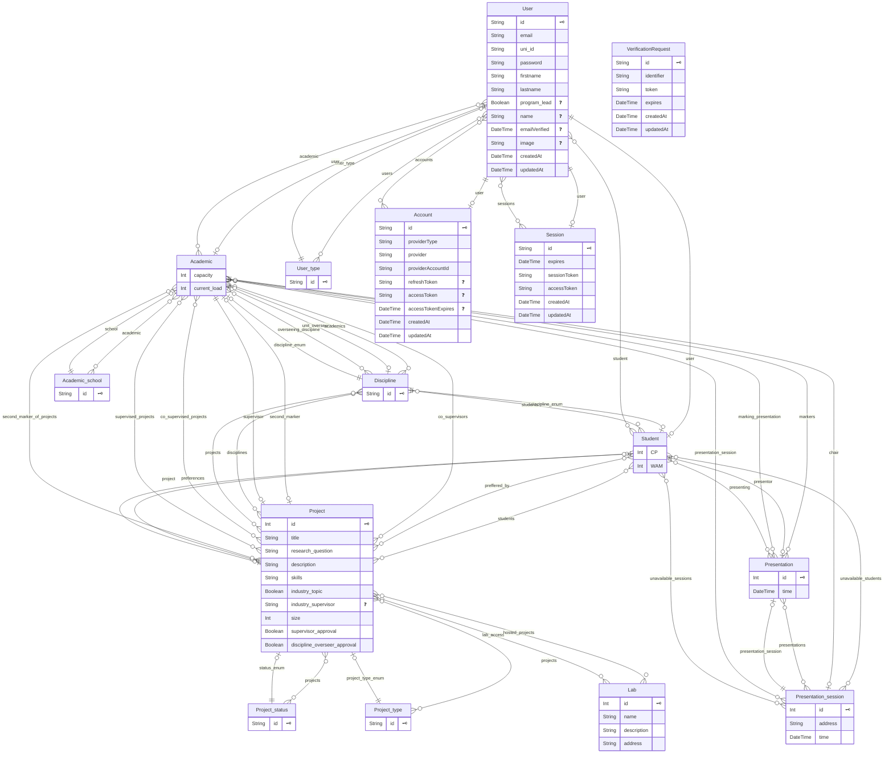

```mermaid
erDiagram

  "User" {
    String id "🗝️"
    String email 
    String uni_id 
    String password 
    String firstname 
    String lastname 
    Boolean program_lead "❓"
    String name "❓"
    DateTime emailVerified "❓"
    String image "❓"
    DateTime createdAt 
    DateTime updatedAt 
    }
  

  "Student" {
    Int CP 
    Int WAM 
    }
  

  "Academic" {
    Int capacity 
    Int current_load 
    }
  

  "Project" {
    Int id "🗝️"
    String title 
    String research_question 
    String description 
    String skills 
    Boolean industry_topic 
    String industry_supervisor "❓"
    Int size 
    Boolean supervisor_approval 
    Boolean discipline_overseer_approval 
    }
  

  "Lab" {
    Int id "🗝️"
    String name 
    String description 
    String address 
    }
  

  "Presentation" {
    Int id "🗝️"
    DateTime time 
    }
  

  "Presentation_session" {
    Int id "🗝️"
    String address 
    DateTime time 
    }
  

  "Discipline" {
    String id "🗝️"
    }
  

  "Project_status" {
    String id "🗝️"
    }
  

  "Project_type" {
    String id "🗝️"
    }
  

  "Academic_school" {
    String id "🗝️"
    }
  

  "User_type" {
    String id "🗝️"
    }
  

  "Account" {
    String id "🗝️"
    String providerType 
    String provider 
    String providerAccountId 
    String refreshToken "❓"
    String accessToken "❓"
    DateTime accessTokenExpires "❓"
    DateTime createdAt 
    DateTime updatedAt 
    }
  

  "Session" {
    String id "🗝️"
    DateTime expires 
    String sessionToken 
    String accessToken 
    DateTime createdAt 
    DateTime updatedAt 
    }
  

  "VerificationRequest" {
    String id "🗝️"
    String identifier 
    String token 
    DateTime expires 
    DateTime createdAt 
    DateTime updatedAt 
    }
  
    "User" o{--}o "Academic" : "academic"
    "User" o{--}o "Account" : "accounts"
    "User" o{--}o "Session" : "sessions"
    "User" o{--}o "Student" : "student"
    "User" o|--|| "User_type" : "user_type"
    "Student" o|--|| "Discipline" : "discipline_enum"
    "Student" o|--|| "User" : "user"
    "Student" o|--|o "Project" : "project"
    "Student" o{--}o "Project" : "preferences"
    "Student" o{--}o "Presentation" : "presenting"
    "Student" o{--}o "Presentation_session" : "unavailable_sessions"
    "Academic" o|--|| "Academic_school" : "school"
    "Academic" o|--|| "Discipline" : "discipline_enum"
    "Academic" o|--|| "User" : "user"
    "Academic" o{--}o "Presentation_session" : "presentation_session"
    "Academic" o{--}o "Project" : "second_marker_of_projects"
    "Academic" o{--}o "Project" : "supervised_projects"
    "Academic" o{--}o "Presentation" : "marking_presentation"
    "Academic" o{--}o "Project" : "co_supervised_projects"
    "Academic" o{--}o "Discipline" : "overseeing_discipline"
    "Project" o|--|| "Project_status" : "status_enum"
    "Project" o|--|| "Project_type" : "project_type_enum"
    "Project" o{--}o "Lab" : "lab_access"
    "Project" o{--}o "Discipline" : "disciplines"
    "Project" o|--|| "Academic" : "supervisor"
    "Project" o|--|o "Academic" : "second_marker"
    "Project" o{--}o "Academic" : "co_supervisors"
    "Project" o{--}o "Student" : "preffered_by"
    "Project" o{--}o "Student" : "students"
    "Lab" o{--}o "Project" : "hosted_projects"
    "Presentation" o|--|| "Presentation_session" : "presentation_session"
    "Presentation" o|--|| "Student" : "presentor"
    "Presentation" o{--}o "Academic" : "markers"
    "Presentation_session" o{--}o "Presentation" : "presentations"
    "Presentation_session" o|--|| "Academic" : "chair"
    "Presentation_session" o{--}o "Student" : "unavailable_students"
    "Discipline" o|--|o "Academic" : "unit_overseer"
    "Discipline" o{--}o "Student" : "students"
    "Discipline" o{--}o "Academic" : "academics"
    "Discipline" o{--}o "Project" : "projects"
    "Project_status" o{--}o "Project" : "projects"
    "Project_type" o{--}o "Project" : "projects"
    "Academic_school" o{--}o "Academic" : "academic"
    "User_type" o{--}o "User" : "users"
    "Account" o|--|| "User" : "user"
    "Session" o|--|| "User" : "user"
```
